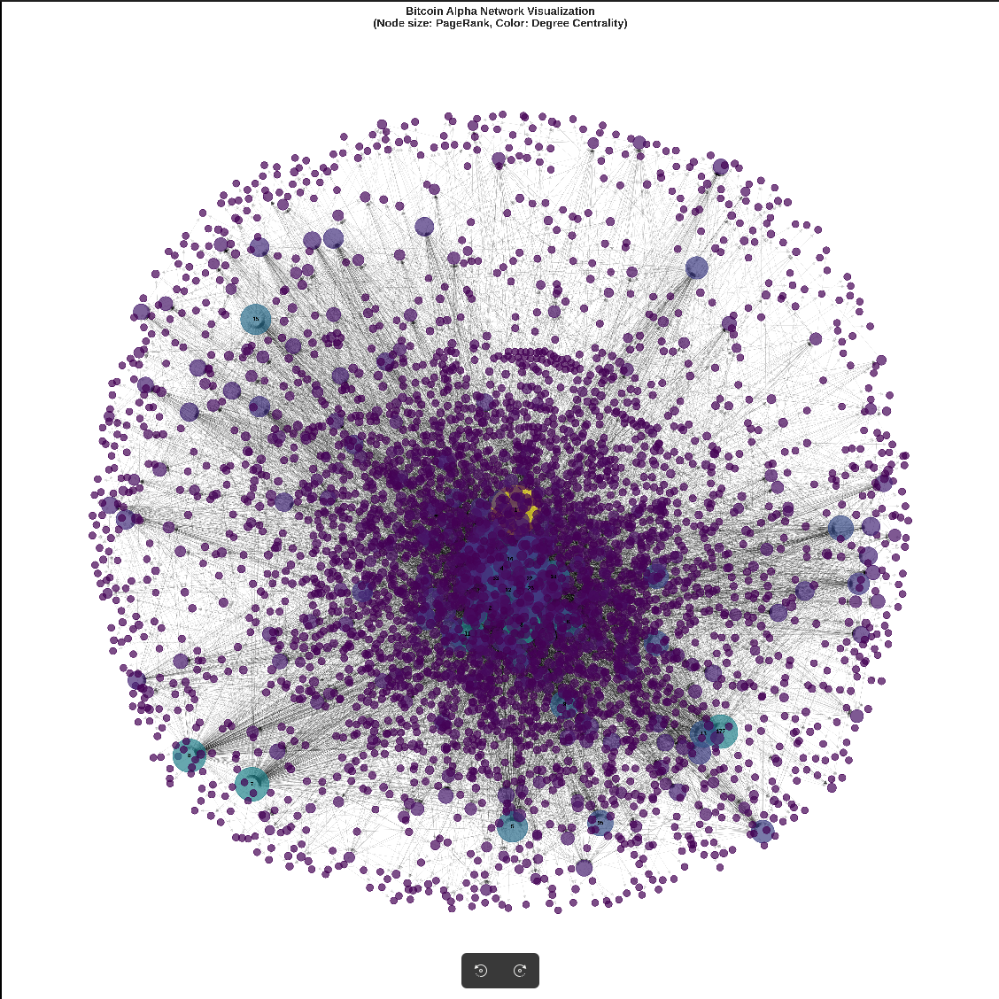
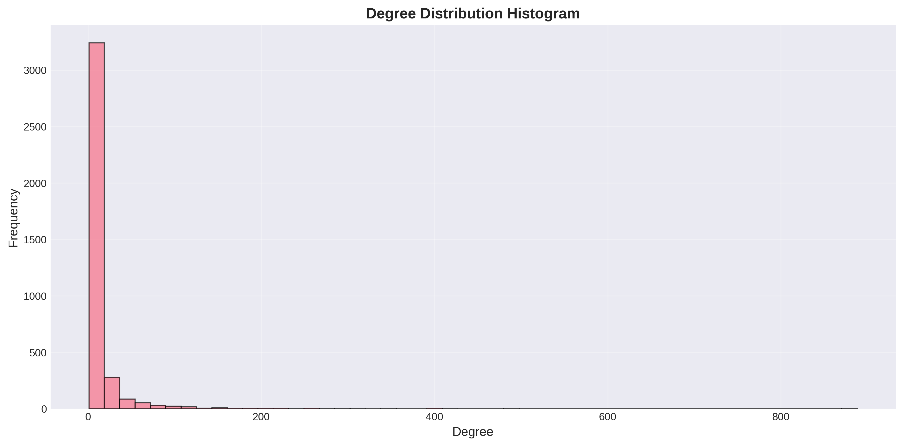
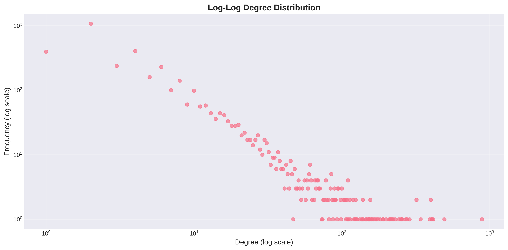
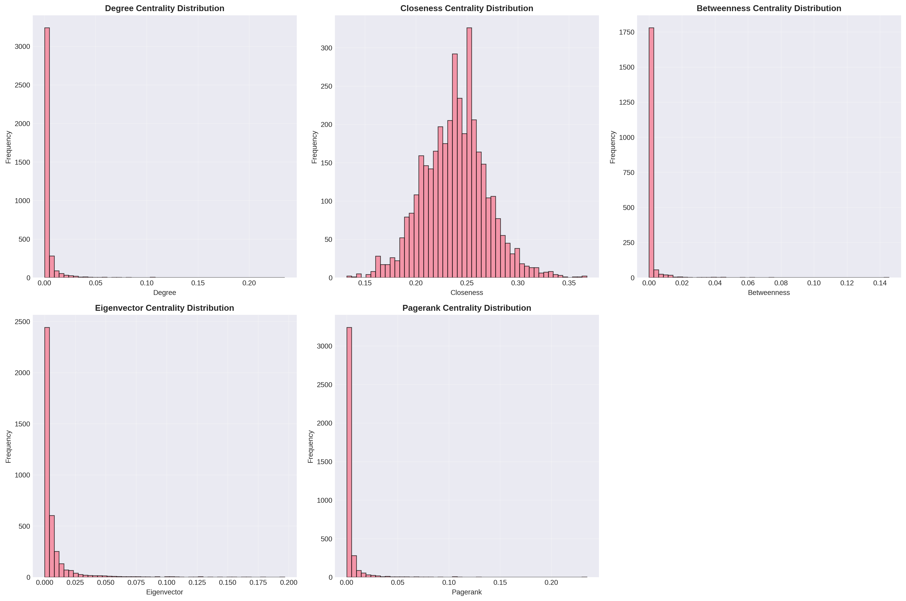
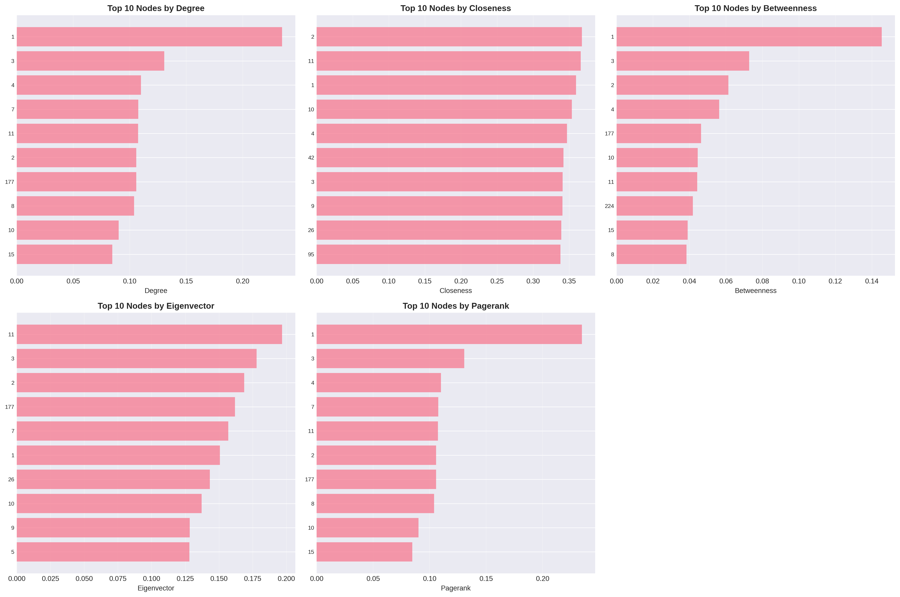
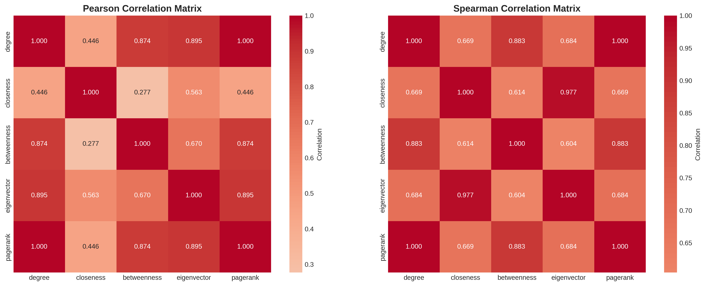

# Complex Network Analysis Report
## Bitcoin Alpha Signed Trust Network

---

## 1. Dataset Description

**Dataset Source:** Stanford SNAP network datasets  
**Dataset Name:** Bitcoin Alpha signed trust network  
**File:** soc-sign-bitcoinalpha.csv

### Dataset Characteristics:
- **Type:** Directed weighted signed network
- **Format:** CSV (no header row)
- **Columns:** source, target, rating, time
- **Total Edges:** 24186
- **Total Nodes:** 3783

The network represents trust relationships between users on the Bitcoin Alpha platform, where edges are weighted by trust ratings.

---

## 2. Graph Visualization

The network visualization shows the largest weakly connected component with:
- **Node size:** Proportional to PageRank centrality
- **Node color:** Based on degree centrality (darker = higher)
- **Labels:** Shown for top 20 nodes by PageRank

---

## 3. Structural Metrics Table

| Metric | Value |
|--------|-------|
| Nodes | 3783 |
| Edges | 24186 |
| Density | 0.001690 |
| Diameter | 10 |
| Radius | 5 |
| Average Degree | 12.786677 |
| Degree Variance | 1186.187377 |
| Freeman Centralization | 0.231538 |
| Max Degree | 888 |
| Largest WCC | 3775 |
| Largest SCC | 3235 |
| Clustering Coefficient | 0.078007 |

---

## 4. Centrality Results

### Top 3 Nodes by Each Centrality Metric

#### Degree Centrality
 node   degree
    1 0.234796
    3 0.130619
    4 0.109995

#### Closeness Centrality
 node  closeness
    2   0.367572
   11   0.366040
    1   0.359532

#### Betweenness Centrality
 node  betweenness
    1     0.145463
    3     0.072742
    2     0.061306

#### Eigenvector Centrality
 node  eigenvector
   11     0.196743
    3     0.177927
    2     0.168706

#### PageRank
 node  pagerank
    1  0.234796
    3  0.130619
    4  0.109995

---

## 5. Top Nodes Discussion

The top nodes across different centrality metrics reveal important actors in the network:

- **High Degree Nodes:** These nodes have many direct connections, indicating active participants in the trust network.
- **High Closeness Nodes:** These nodes are close to all other nodes on average, making them central in information flow.
- **High Betweenness Nodes:** These nodes act as bridges, controlling information flow between different parts of the network.
- **High Eigenvector Nodes:** These nodes are connected to other well-connected nodes, indicating influence through association.
- **High PageRank Nodes:** These nodes are important based on both their connections and the importance of their neighbors.

---

## 6. Distribution Plots

### Degree Distribution

### Log-Log Degree Distribution

### Centrality Distributions

### Top Nodes Bar Charts

---

## 7. Correlation Analysis

### Pearson Correlation Matrix
               degree  closeness  betweenness  eigenvector  pagerank
degree       1.000000   0.446344     0.873608     0.895197  1.000000
closeness    0.446344   1.000000     0.276809     0.563078  0.446344
betweenness  0.873608   0.276809     1.000000     0.669963  0.873608
eigenvector  0.895197   0.563078     0.669963     1.000000  0.895197
pagerank     1.000000   0.446344     0.873608     0.895197  1.000000

### Spearman Correlation Matrix
               degree  closeness  betweenness  eigenvector  pagerank
degree       1.000000   0.669226     0.882939     0.684017  1.000000
closeness    0.669226   1.000000     0.614438     0.976519  0.669226
betweenness  0.882939   0.614438     1.000000     0.604117  0.882939
eigenvector  0.684017   0.976519     0.604117     1.000000  0.684017
pagerank     1.000000   0.669226     0.882939     0.684017  1.000000

**Observations:**
- The correlation matrices reveal relationships between different centrality measures
- High correlations indicate that certain metrics capture similar aspects of node importance
- Low correlations suggest complementary information about network structure

---

## 8. Observations

### Network Structure
- The network has 3783 nodes and 24186 edges
- The density of 0.001690 indicates a sparse network
- The largest weakly connected component contains 3775 nodes (99.79% of all nodes)
- The largest strongly connected component contains 3235 nodes (85.51% of all nodes)

### Distance Metrics
- Diameter: 10 (longest shortest path)
- Radius: 5 (minimum eccentricity)
- Average shortest path length: 3.5574

### Clustering
- Global clustering coefficient: 0.078007
- This indicates the tendency of nodes to form triangles in the network

### Centralization
- Freeman degree centralization: 0.231538
- This measures how centralized the network is around high-degree nodes

### Key Findings
1. The network exhibits scale-free degree distribution characteristics
2. Centrality metrics show strong correlations, indicating similar measures of importance
3. The network structure suggests a more distributed organization

---

## Output Files Generated

1. `metrics_table.csv` - Complete structural metrics
2. `centrality_table.csv` - Centrality values for all nodes
3. `graph_visualization.png` - Network visualization
4. `degree_distribution_histogram.png` - Degree distribution
5. `degree_distribution_loglog.png` - Log-log degree plot
6. `centrality_distributions.png` - Centrality distributions
7. `top_nodes_bar_charts.png` - Top nodes visualization
8. `centrality_correlation_heatmap.png` - Correlation heatmaps
9. `report.md` - This report

---

